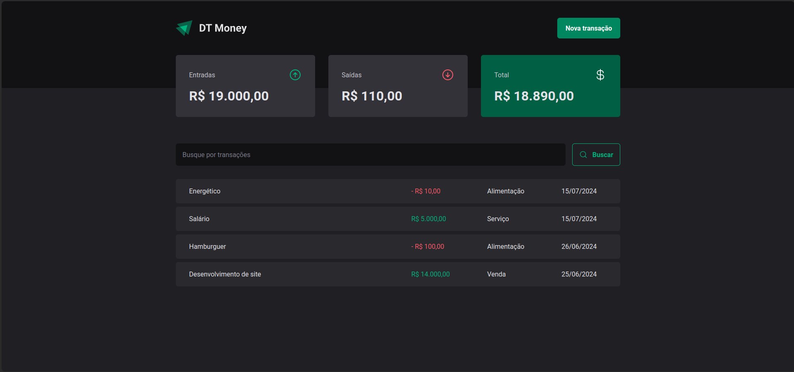

# Sobre o projeto

## Prints da aplicação:

<div>
    
    
</div>
 
### Como rodar o projeto.

Execute:

```bash
  npm install
```

and

```bash
  npm run dev:server
```

and

```bash
  npm run dev
```
